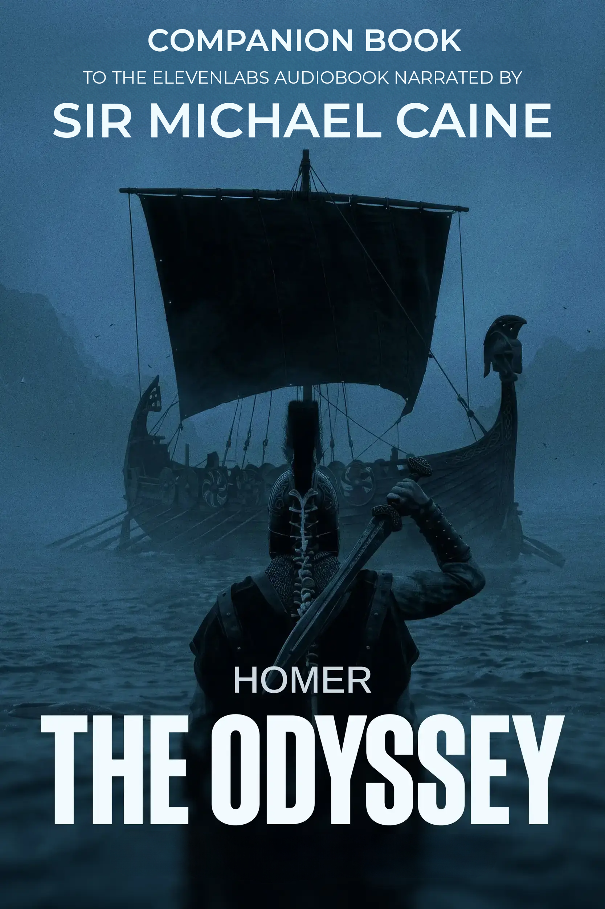

# *The Odyssey* — Companion Ebook to the ElevenLabs Michael Caine Audiobook



A free companion ebook for the [ElevenLabs audiobook of *The Odyssey*](https://elevenreader.io/the-odyssey), narrated by the AI voice of Sir Michael Caine (ElevenProductions, 2026). It is William Cullen Bryant's 1871 translation with the most prominent character and deity names rendered in their Greek forms — **Odysseus** instead of *Ulysses*, **Zeus** instead of *Jove*, **Poseidon** instead of *Neptune*, **Athena** instead of *Pallas*, and so on — so the printed text matches the names spoken in the narration, word for word, across all 24 books.

<br clear="left" />

## Why this exists

ElevenLabs' Michael Caine narration follows Bryant's translation closely, but it speaks a handful of the most prominent names in their Greek form — **Odysseus** for *Ulysses*, **Zeus** for *Jove/Jupiter*, **Poseidon** for *Neptune*, **Athena** for *Pallas*, **Hera** for *Juno*, **Cronos** for *Saturn*, and **Hermes** for *Mercury*. [The underlying text is Bryant's translation](https://www.nytimes.com/2026/06/23/books/michael-caine-odyssey-ai.html); most of its other Latinate names (Minerva, Venus, Mars, Diana, Vulcan…) are left exactly as he wrote them. While listening to the Michael Caine narration, I like to read the text as well. I couldn't find a Greek-names edition of Bryant's translation that matches the Michael Caine narration word for word. This repo fixes that.

If you're listening to the Michael Caine Odyssey audiobook on ElevenReader and want a text to follow along with, this is it.

## How to use it

Download the ebook from the [latest release page](https://github.com/sstoilovABLE/odyssey-ebook-michael-caine-elevenlabs-narration/releases/latest) and read it while listening to the Michael Caine audiobook on the [ElevenReader app](https://elevenreader.io).

Each release offers the same book in several formats — pick the one for your device:

- **Compatible EPUB** (`.epub`) — works across most e-readers (Apple Books, Google Play Books, Calibre, Nook, and others) *except* Kindles and very old devices. This is the recommended choice if you're unsure, and the universal fallback.
- **Kindle** (`.azw3`) — Amazon's proprietary format for Kindle e-readers and the Kindle desktop/Android apps (not the iOS app). Choose this on a Kindle for the best formatting, including hyphenation and kerning.
- **Kobo** (`.kepub.epub`) — a build tuned for Kobo's WebKit-based renderer. Plain EPUBs work on Kobos too, but this format gives noticeably better typography and rendering on those devices.
- **Advanced EPUB** (`_advanced.epub`) — uses the latest ebook technology and is aimed at developers testing modern reading systems rather than general use. Only grab this if you specifically want it.

The formats offered and this guidance follow the [Standard Ebooks conventions](https://standardebooks.org/help/how-to-use-our-ebooks), the same toolset used to produce the upstream source; see their help page for step-by-step instructions on transferring each file to your device.

## Name changes (matching the narration)

Audio-verified against the released narration. These are the **only** names this edition changes from Bryant — the ones actually spoken in Greek form. Everything else is left as Bryant wrote it.

| Michael Caine audiobook and this ebook (Greek) | Bryant's text | Occurrences |
|---|---|---|
| Odysseus | Ulysses | 618 |
| Zeus | Jove, Jupiter | 242 |
| Athena | Pallas | 160 |
| Poseidon | Neptune | 52 |
| Cronos | Saturn | 19 |
| Hera | Juno | 7 |
| Hermes | Mercury | 4 |

Possessives keep Bryant's own punctuation and change only the stem: *Ulysses’ → Odysseus’*, *Jove’s → Zeus’s*, *Neptune’s → Poseidon’s*, *Saturn’s → Cronos’s*, *Juno’s → Hera’s*.

### Kept as Bryant wrote them

The narration does **not** Hellenise these, so this edition leaves them untouched: Minerva, Venus, Vulcan, Diana, Ceres, Latona, Mars, Pluto, Proserpine, Bacchus, Phoebus, Apollo, Aurora.

Bryant uses both *Pallas* and *Minerva* for Athena; the narration says **Athena** only for *Pallas* and keeps *Minerva*, so both names appear in this text — exactly as in the audio.

The mapping lives in [`scripts/substitutions.json`](scripts/substitutions.json) and is applied by [`scripts/substitute.py`](scripts/substitute.py); [`scripts/extract_names.py`](scripts/extract_names.py) re-scans the books to confirm no Bryant forms remain.

## The audiobook's introduction

The Michael Caine narration opens with a short framing introduction — an **Eleven Productions original** that is *not* part of Bryant's translation — setting up who Odysseus is and where the story finds him before Book I begins. This edition includes it as a front-matter **Introduction**, transcribed from the audiobook so the text matches what you hear. It sits after the editor's note and before the half-title page; an endnote flags that it is not part of Homer's poem.

Unlike the rest of the poem (Bryant's blank verse), the Introduction is set as **prose**, since that is how the narration delivers it. Aside from the front-matter editor's note described below, it is the only content added to the story; everything from Book I onward is Bryant's translation with the name changes above.

## Editor's note and Bryant's preface

This edition opens with a short **editor's note** ("About This Edition") explaining the name change and the trade-off it makes with Bryant's metre. Bryant's own **1871 preface** — in which he argued *for* the Roman names, on the strength of English poetic tradition — has been moved to the **back of the book**, where it is preserved in full as a document of its time. **Endnotes** at the back record every name that was changed and every Latinate name deliberately kept.

## Building the ebook

This edition is built with the [Standard Ebooks toolset](https://standardebooks.org/tools), the same tooling used to produce the upstream source. The toolset is Linux/macOS based — on Windows you'll need to run it under [WSL](https://learn.microsoft.com/windows/wsl/install) — and requires **Python 3.10.12 or newer**.

### Install the dependencies and toolset

```bash
sudo apt install -y calibre default-jre git python3-dev python3-pip python3-venv pipx
pipx install standardebooks
```

To update an existing installation later:

```bash
pipx upgrade standardebooks
```

### Lint and build

Run the linter before building. Pass `epub-src/` as the project path (the SE source lives there, not at the repo root):

```bash
se lint epub-src/
se build epub-src/
```

### Useful build flags

| Flag | Effect |
|---|---|
| `--check` | Run `epubcheck` to validate the output |
| `--kindle` | Also produce an Amazon Kindle file (`.azw3`) |
| `--kobo` | Also produce a Kobo file (`.kepub`) |
| `--output-dir DIR` | Write the built files to `DIR` |

Recommended full command — lint, then build all formats with validation:

```bash
se lint epub-src/
se build --check --kindle --kobo epub-src/
```

## A note on metre

Bryant wrote his translation in blank verse (unrhymed iambic pentameter). The Greek and Roman forms of these names are **not** syllable-equivalent — *Odysseus* has one more syllable than *Ulysses*, *Poseidon* than *Neptune*, *Athena* than *Pallas* — so substituting them breaks Bryant's scansion in many lines.

This is a deliberate trade-off. The edition exists to match the names you hear in the Caine/ElevenLabs narration, and that goal takes priority over preserving the original metre. No attempt has been made to repair the verse around the changed names. Treat this as a reading companion to the audiobook rather than a metrically faithful or scholarly text; for Bryant's translation as written, use the upstream Standard Ebooks edition linked below.

## Source & license

This is an **unofficial derivative work**. The base text comes from the [Standard Ebooks edition of Bryant's translation](https://standardebooks.org/ebooks/homer/the-odyssey/william-cullen-bryant), itself derived from public-domain scans of Bryant's 1871 first edition. Like the upstream production, all text within this edition is released into the public domain under [CC0 1.0 Universal](https://creativecommons.org/publicdomain/zero/1.0/).

The ebook cover is *not* released into the public domain. The new cover artwork was created by the repository author, based on the cover art for the Michael Caine-narrated audiobook on ElevenReader. A request for permission to release the modified cover was sent to ElevenLabs Legal on July 1, 2026; as of this writing, no response has been received. Should ElevenLabs contact the repo author with a request to remove copyrighted material, the author commits to doing so promptly. The author respects ElevenLabs's copyright, does not seek to profit from this ebook's release, and — given that the ElevenReader audiobook itself is released for free — does not consider this ebook to be in competition with the audiobook or to be harmful to rightsholders' interests.

This is not an official Standard Ebooks release and carries no endorsement from Standard Ebooks. Standard Ebooks is not responsible for the name changes, the metre changes, or anything else in this edition. For the canonical, unmodified production, see the [upstream repository](https://github.com/standardebooks/homer_the-odyssey_william-cullen-bryant).

This is not an official ElevenReader release - it carries no endorsement from ElevenLabs.

## Related

- [ElevenLabs *Odyssey* audiobook](https://elevenreader.io/the-odyssey) — free on ElevenReader
- [ElevenLabs blog post](https://elevenlabs.io/blog/the-odyssey-michael-caine)
- [Standard Ebooks source repo](https://github.com/standardebooks/homer_the-odyssey_william-cullen-bryant)
